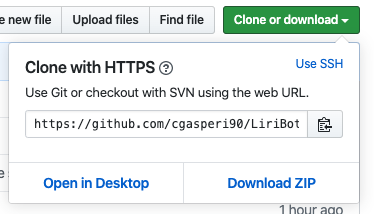
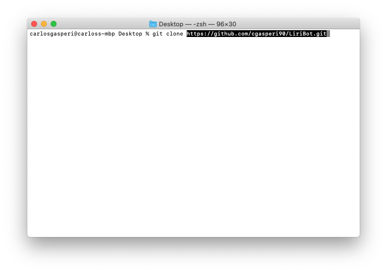
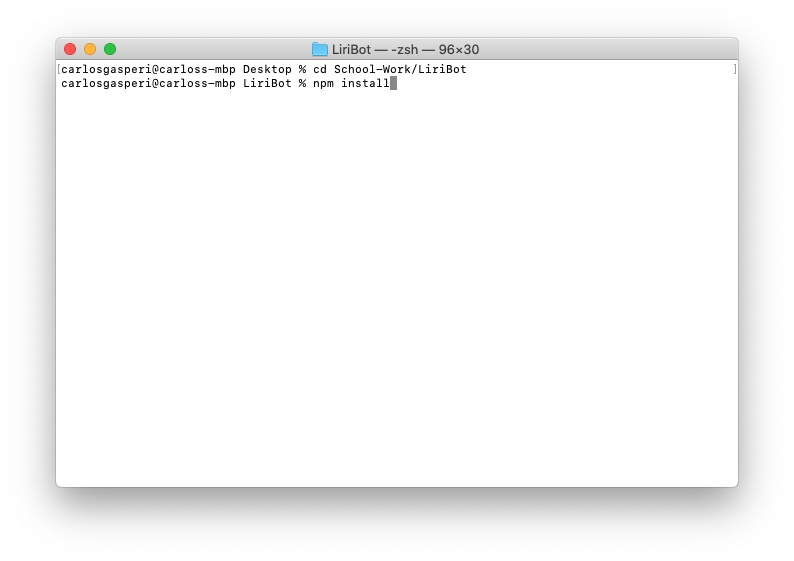
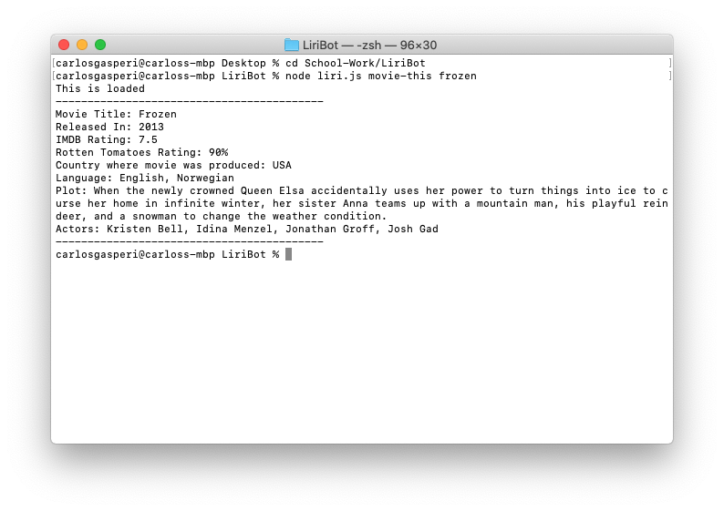
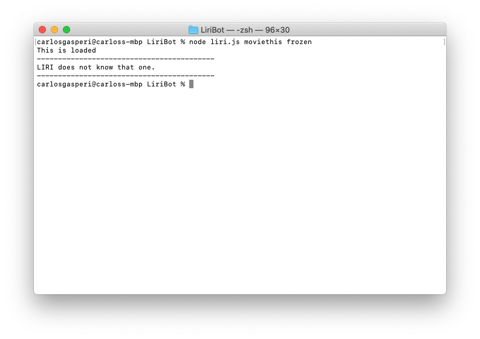

# LiriBot

## What LIRI can do
LIRI is an app that can take in certain commands and outputs information based off of the command it is given. LIRI has four commands that it can be given. LIRI pulls information from 3 different API's. This app can be used by anyone that wants to get more information on any songs, movies, or concerts. The user can search for songs in spotify and can also find a link to the song that can lead them directly to the Spotify app or website. Th user can also search any movie and find information about the movie, like the title, actors in the movie, release year, and more. Lastly, the user can search for concerts from their favorite artists and see the name of the concert and where the event will be held.

## API's
*   Spotify
*   OMDBAPI
*   Bands In Town API

## Technologies
In LIRI, we used multiple technologies in order to create the App.
*   Node.js
    ###### Dependencies
    *   Axios NPM Package
    *   Moment NPM Package
    *   FS NPM Package
    *   Spotify NPM Package
    *   dotenv NPM Package
*   Javascript

## Commands that can be used
*   spotify-this-song
    *   This command can be used to search for any song listed in the Spotify API.
*   movie-this
    *   This command can be used to search for any movie within the OMDBAPI.
*   concert-this
    *   This command can be used to search for artists' upcoming events.
*   do-what-it-says
    *   This command, when ran, will read text inside of *random.txt* file and run the command inside the file.

## Organization
LIRI is set up in multiple Javascript files. One file holds the keys to the API's. This javascript file is ignored by GitHub in order to protect the API keys. The other javascript file holds the rest of the code that runs the app. Because this app is ran using Node.js, the app contains a *package.json* file so that a user can install the entire package onto their machine.

## Instructions
1. Clone the GitHub repo onto your machine. Here is the to the [GitHub] (https://github.com/cgasperi90/LiriBot.git) repository page.
*   
2. Once the repository has been copied, then go to your terminal to clone the repository.
*   

3. Go to your terminal on your machine, navigate to the root folder of LIRI.

4. Run "npm install" so that the *package.json* file gets installed and the app will work properly on your machine.
*   

5. Once installed, you will type "node", followed by the name of the main file "liri.js", then the command desired "movie-this", and lastly, what the user wants to search for.
    *   Ex of a search for a movie
        *   "node liri.js movie-this frozen"
*   
*   These are the results that populate from the search.
*   

6. If all the commands were typed in correctly, then the information that was requested should populate. If there is a misspelling in the command, LIRI will alert that the command is not known.
*   

